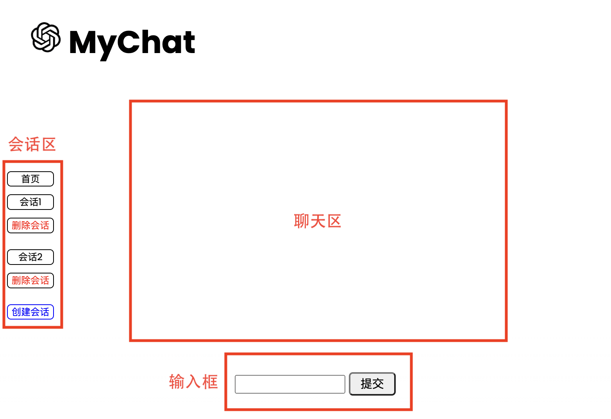
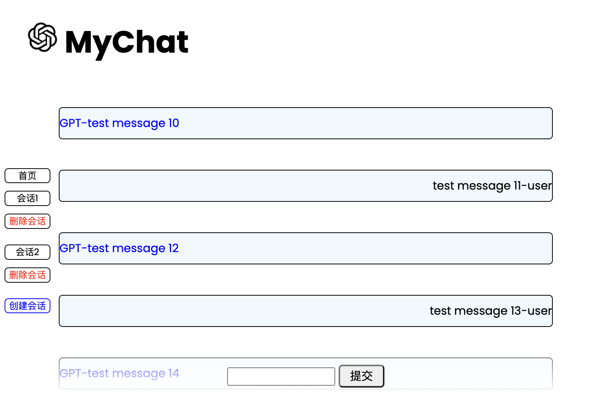

# MyChat（基于GPT api 实现的聊天web应用）

## 项目描述

MyChat是一个基于springboot及相关技术栈开发的web聊天应用，主要利用OpenAI的GPT api使用（**在使用的时候科学上网**），功能除了基本的聊天外，前端提供了创建新会话的功能，同步到后台数据库，后端提供了接口的调用，同时将每一次会话及会话聊天内容都保存到数据库中。

## 项目展示

- 前端展示

  

- 后端测试数据回显

  

## 项目开发

### 技术栈

- **前端技术栈**：html、css、js、ajax、thymeleaf

  html、css、js主要是提供一些首页和聊天框设计

  ajax用于页面局部更新以及异步聊天的实现

  thymeleaf模版引擎用于获取后端回传的数据在前端页面上显示

- **后端技术栈**：Springboot、Lombok、Okhttp3、Fastjson2、Mybatis-plus、MySQL

  利用Okhttp3进行GPT api的调用

  Mybatis-plus对数据库进行便捷的CRUD操作

  MySQL数据中主要设计了会话表以及消息表

---

### 数据库设计（会话表、消息表）

#### 会话表

```sql
DROP TABLE IF EXISTS `chat`;
CREATE TABLE `chat` (
  `id` bigint NOT NULL AUTO_INCREMENT COMMENT '主键ID',
  `theme` varchar(255) CHARACTER SET utf8mb4 COLLATE utf8mb4_0900_ai_ci NOT NULL COMMENT '会话主题',
  `create_time` datetime NOT NULL COMMENT '创建时间',
  `update_time` datetime NOT NULL COMMENT '更新时间',
  `deleted` int NOT NULL DEFAULT '0' COMMENT '逻辑删除',
  PRIMARY KEY (`id`)
) ENGINE=InnoDB AUTO_INCREMENT=3 DEFAULT CHARSET=utf8mb4 COLLATE=utf8mb4_0900_ai_ci;
```

#### 消息表

```sql
DROP TABLE IF EXISTS `message`;
CREATE TABLE `message` (
  `id` bigint NOT NULL AUTO_INCREMENT COMMENT '主键',
  `content` text CHARACTER SET utf8mb4 COLLATE utf8mb4_0900_ai_ci NOT NULL COMMENT '信息内容',
  `flag` tinyint(1) NOT NULL DEFAULT '0' COMMENT '信息来源',
  `chat_id` bigint NOT NULL COMMENT '会话ID',
  `create_time` datetime NOT NULL COMMENT '创建时间',
  `update_time` datetime NOT NULL COMMENT '更新时间',
  `deleted` int NOT NULL DEFAULT '0' COMMENT '逻辑删除',
  PRIMARY KEY (`id`),
  KEY `chatfk` (`chat_id`),#这里设置一个外键绑定chat表中的ID
  CONSTRAINT `chatfk` FOREIGN KEY (`chat_id`) REFERENCES `chat` (`id`) ON UPDATE CASCADE
) ENGINE=InnoDB AUTO_INCREMENT=23 DEFAULT CHARSET=utf8mb4 COLLATE=utf8mb4_0900_ai_ci;
```

#### 测试数据（见chat.sql）

---

### OpenAI api使用

- OKHttpUtils工具类

  ```java
  public class OKHttpUtils {
      //构造客户端的连接
      public static OkHttpClient client  = new OkHttpClient.Builder()
              .protocols(Collections.singletonList(Protocol.HTTP_1_1))
              .connectTimeout(100, TimeUnit.SECONDS)
              .readTimeout(100, TimeUnit.SECONDS)
              .retryOnConnectionFailure(true)
              .build();
  
      //修改请求内容类型
      public static final MediaType MT = MediaType.get("application/json");
  
      //Post请求：url请求连接、reqParams请求参数，token请求apikey
      public static JSONObject dePost(String url, String reqParams, String token) throws Exception {
          RequestBody requestBody = RequestBody.create(reqParams, MT);
          Request request = new Request.Builder()
                  .url(url)
                  .addHeader("Authorization", "Bearer " + token)
                  .post(requestBody)
                  .build();
          Call call = client.newCall(request);
          Response response = call.execute();
          JSONObject body = JSON.parseObject(response.body().string());
          return body;
      }
  
      //Get请求：url请求连接、token请求apikey
      public static JSONObject doGet(String url, String token) throws IOException {
          Request request = new Request.Builder()
                  .url(url)
                  .addHeader("Authorization", "Bearer " + token)
                  .build();
          Call call = client.newCall(request);
          Response response = call.execute();
          JSONObject body = JSON.parseObject(response.body().string());
          return body;
      }
  }
  ```
- OpenAIUtils工具类：需要配置自己的API key

  ```java
  public class OpenAIUtils {
      //请求api
      public static String url = "https://api.openai.com/v1/chat/completions";
  
      //这是我自己申请的api设置
      public static String api = "这里需要配置你的API key";
  
      //返回gpt信息
      public static String chat(String message) {
          //设置相关请求参数
          Map<String, Object> paramMap = new HashMap<>();
          paramMap.put("model", "gpt-3.5-turbo");
          paramMap.put("max_tokens", 1000);
          List<Map<String, String>> dataList = new ArrayList<>();
          dataList.add(new HashMap<String, String>(){{
              put("role", "user");
              put("content", message);
          }});
          paramMap.put("messages", dataList);
          String params = JSON.toJSONString(paramMap);
  				//设置返回的消息
          String answer = null;
          try {
              JSONObject responseBody = OKHttpUtils.dePost(url, params, api);
              JSONArray choices = responseBody.getJSONArray("choices");
              JSONObject result = (JSONObject) choices.get(0);
              answer = result.getJSONObject("message").getString("content");
          } catch (Exception e) {
              e.printStackTrace();
              return "出现了异常";
          }
          return answer;
      }
  }
  ```

---

### 前端设计（主要介绍相关js）

- 数据的回显、GPT打字效果

  - 数据的回显都是采用这个thymeleaf模版引擎进行后端数据的回显
  - 打字效果采用的是typed.umd.js

    ```javascript
    //打字效果 将获取的消息在gpt-msg元素中打印出来
    var typed = new Typed("#gpt-msg", {
        strings:["GPT-"+data.content],//配置你想打印的信息
        typeSpeed: 10,
        backSpeed: 10,
        backDelay: 1000,
        loop: false
    });
    ```

- 聊天滚轮自动划到底部

  ```javascript
  $(function() {
    //这里是获取了html和body，加上了滚轮的动作
  	$("html, body").animate({ scrollTop: $(document).height() }, "fast");
  });
  ```
- ajax局部页面更新以及异步请求响应

  - 页面聊天中，只是单独局部更新页面中聊天框的内容，所以可以采用jquery绑定事件进行局部的页面更新

    ```javascript
    $("#sm").click(function () {
        var chatId = $("#chatId").val();
        if (chatId == '') {
            alert("请选择会话！")
            return false;
        }
        var content = $("#content").val();
        if (content == '') {
            alert("请输入信息！")
            return false;
        }
    
        $(function() {
            $("html, body").animate({ scrollTop: $(document).height() }, "fast");
        });
        if ($("#chatWindow").children("p:last-child").length) {
            $("#chatWindow").children("p:last-child").after("<p class='message0'>"+$("#content").val()+"-user</p>");
        } else {
            $("#chatWindow").prepend("<p class='message0'>"+$("#content").val()+"-user</p>");
        }
      	//后面紧跟ajax异步请求
     });
    ```

  - 同时利用ajax的异步请求将前端输入的内容回传到后面的AjaxController，进一步将获取到的响应消息回传给页面进行局部更新

    ```javascript
    $.ajax({
        url: "http://localhost:8080/ajax",
        data: {"chatId":chatId,"content":content},
        type: "post",
        dataType: "json",
        success: function (data) {
            $(function() {
                $("html, body").animate({ scrollTop: $(document).height() }, "fast");
            });
            $("#chatWindow").children("p:last-child").after("<p class='message1' id='gpt-msg'></p>");
            //打字效果
            var typed = new Typed("#gpt-msg", {
                strings:["GPT-"+data.content],
                typeSpeed: 10,
                backSpeed: 10,
                backDelay: 1000,
                loop: false
            });
        },
        error: function () {
            alert("服务器发生了错误");
        }
    });
    ```


---

### 后端设计

- 两张表数据的实体类以及Mapper

  参照数据库中表的设计实体类

  ```java
  @Data
  @AllArgsConstructor
  @NoArgsConstructor
  public class Chat {
      @TableId(type = IdType.AUTO)
      private Integer id;//会话id
      private String theme;//会话主题：默认为当前会话第一句话
  
      @TableField(fill = FieldFill.INSERT)
      private Date createTime;//会话创建时间
  
      @TableField(fill = FieldFill.INSERT_UPDATE)
      private Date updateTime;//会话更新时间：会在每一次输入时进行更新
  
      @TableLogic
      private Integer deleted;//逻辑删除
  }
  
  @Data
  @AllArgsConstructor
  @NoArgsConstructor
  public class Message {
      @TableId(type = IdType.AUTO)
      private Integer id;//信息id：主键
      private String content;//信息内容
      private Integer flag;//信息来源：1 user 0 AI
      private Integer chatId;//当前会话Id
  
      @TableField(fill = FieldFill.INSERT)
      private Date createTime;//创造时间
  
      @TableField(fill = FieldFill.INSERT_UPDATE)
      private Date updateTime;//更新时间
  
      @TableLogic
      private Integer deleted;//逻辑删除
  }
  ```

  相关mapper：这里要设置一个主键顺序自增的方法，来保证在数据修改的过程中主键的顺序一致

  ```java
  @Repository
  public interface ChatMapper extends BaseMapper<Chat> {
      //id主键顺序递增刷新操作
      @Update("alter table chat auto_increment=1")
      public void alter();
  }
  
  @Repository
  public interface MessageMapper extends BaseMapper<Message> {
      //id主键顺序递增刷新操作
      @Update("alter table message auto_increment=1")
      public void alter();
  }
  
  ```
- 相关配置信息设置以及静态资源映射

  application.properties

  ```properties
  #服务端口
  server.port=8080
  #禁用模板缓存
  spring.thymeleaf.cache=false
  #数据库连接配置
  spring.datasource.username=用户名
  spring.datasource.password=密码
  spring.datasource.url=jdbc:mysql://localhost:3306/chat?useSSL=false&useUnicode=true&characterEncoding=utf-8&serverTimezone=GMT%2B8
  spring.datasource.driver-class-name=com.mysql.jdbc.Driver
  spring.datasource.type=com.alibaba.druid.pool.DruidDataSource
  #日志配置
  mybatis-plus.configuration.log-impl=org.apache.ibatis.logging.stdout.StdOutImpl
  #配置逻辑删除
  mybatis-plus.global-config.db-config.logic-delete-value=1
  mybatis-plus.global-config.db-config.logic-not-delete-value=0
  ```

	config下的配置类

  ```java
  //MyBatisPlus配置类
  @MapperScan("com.tech.chat.mapper")
  @EnableTransactionManagement
  @Configuration
  public class MyBatisPlusConfig {
      //配置逻辑删除组件
      @Bean
      public ISqlInjector sqlInjector() {
          return new LogicSqlInjector();
      }
  }
  
  //SpringMVCSupport静态资源映射配置类
  @Configuration
  public class SpringMVCSupport extends WebMvcConfigurationSupport {
      //添加静态资源映射
      @Override
      protected void addResourceHandlers(ResourceHandlerRegistry registry) {
          registry.addResourceHandler("/static/**").addResourceLocations("classpath:/static/");
      }
  }
  ```
- Service层CRUD功能实现

  ChatService.class

  ```java
  @Service
  public class ChatService {
      @Autowired
      ChatMapper chatMapper;
  
      //id顺序递增
      public void alter() {
          chatMapper.alter();
      }M
  
      //查找所有存在chat
      public List<Chat> queryAll() {
          return chatMapper.selectList(null);
      }
  
      //根据id查找chat
      public Chat queryById(int id) {
          return chatMapper.selectById(id);
      }
  
      //增加一个chat
      public int insertChat(Chat chat) {
          return chatMapper.insert(chat);
      }
  
      //根据id删除chat
      public int deleteById(int id) {
          return chatMapper.deleteById(id);
      }
  
      //更新chat
      public int updateChat(Chat chat) {
          return chatMapper.update(chat, null);
      }
  }
  ```

  MessageService.class

  ```java
  @Service
  public class MessageService {
      @Autowired
      MessageMapper messageMapper;
  
      //id顺序递增
      public void alter() {
          messageMapper.alter();
      }
  
      //根据chat_id查找所有message
      public List<Message> queryByChatId(int chatId) {
          QueryWrapper<Message> messageQueryWrapper = new QueryWrapper<>();
          messageQueryWrapper.eq("chat_id", chatId);
          return messageMapper.selectList(messageQueryWrapper);
      }
  
      //根据chat_id删除所有message
      public int deleteAllByChatId(int chatId) {
          QueryWrapper<Message> messageQueryWrapper = new QueryWrapper<>();
          messageQueryWrapper.eq("chat_id", chatId);
          return messageMapper.delete(messageQueryWrapper);
      }
  
      //根据id查找message
      public Message queryById(int id) {
          return messageMapper.selectById(id);
      }
  
      //增加一个message
      public int insertMessage(Message message) {
          return messageMapper.insert(message);
      }
  
      //根据id删除message
      public int deleteById(int id) {
          return messageMapper.deleteById(id);
      }
  
      //更新message
      public int updateMessage(Message message) {
          return messageMapper.update(message, null);
      }
  }
  ```
- IndexController、ChatController、MessageController、AjaxController

  IndexController.class

  ```java
  @Controller
  public class IndexController {
      @Autowired
      ChatService chatService;
  
    	//默认的首页显示
      @RequestMapping({"/", "/index", "/index.html"})
      public String index(Model model) {
          //这里是提前查询了这个有多少个历史会话
          Collection<Chat> chats = chatService.queryAll();
          model.addAttribute("chats", chats);
          return "index";
      }
  }
  ```

  ChatController.class：控制会话的显示创建删除

  ```java
  @Controller
  public class ChatController {
      @Autowired
      ChatService chatService;
  
      @Autowired
      MessageService messageService;
  
    	//这里chatId是从前端传递来的
      @RequestMapping("/chat/create/{chatId}")
      public String createChat(@PathVariable("chatId") Integer chatId, Model model) {
          chatService.alter();
          Chat chat = new Chat();
          chat.setId(chatId);
          chat.setTheme("会话" + chatId);
          chatService.insertChat(chat);
          model.addAttribute("chatId", chatId);
          return "forward:/index";
      }
  
    	//这里chatId是从前端传递来的
      @RequestMapping("/chat/delete/{chatId}")
      public String deleteChat(@PathVariable("chatId") Integer chatId) {
          messageService.deleteAllByChatId(chatId);
          chatService.deleteById(chatId);
          return "forward:/index";
      }
  }
  ```

  MessageController.class：主要控制了聊天记录的显示，通过chatid来查询不同会话的聊天记录

  ```java
  @Controller
  public class MessageController {
      @Autowired
      MessageService messageService;
  
    	//这里id是从前端传递来的
      @GetMapping("/message/show/{id}")
      public String showMessages(@PathVariable("id") Integer id, RedirectAttributes redirectAttributes) {
          messageService.alter();
          List<Message> msgs = messageService.queryByChatId(id);
          if (msgs.size() == 0) {
              redirectAttributes.addFlashAttribute("msgs", null);
          } else {
              redirectAttributes.addFlashAttribute("msgs", msgs);
          }
          redirectAttributes.addFlashAttribute("chatId", id);
          return "redirect:/index";
      }
  }
  ```

  AjaxController.class：这是实现聊天功能的关键

  ```java
  @Controller
  public class AjaxController {
      @Autowired
      MessageService messageService;
  
      @PostMapping("/ajax")
      @ResponseBody
      public JSONObject ajax(@RequestParam("chatId") Integer chatId, @RequestParam("content") String content) {
          Collection<Message> msgs = messageService.queryByChatId(chatId);
          Message message = new Message();
          message.setContent(content);
          message.setFlag(0);
          message.setChatId(chatId);
          messageService.insertMessage(message);
          msgs.add(message);
  
          Message messageGPT = new Message();
          messageGPT.setContent(OpenAIUtils.chat(content));
          messageGPT.setFlag(1);
          messageGPT.setChatId(chatId);
          messageService.insertMessage(messageGPT);
          msgs.add(messageGPT);
  
          JSONObject messageAI = (JSONObject) JSON.toJSON(messageGPT);
          return messageAI;
      }
  }
  ```
- Mybatis-plus自动填充、自增主键、逻辑删除实现（详细见Mybatis-plus的文档）

---

## 项目扩展

- 前端调整
- 后台频繁查询，要使用缓存来减少与数据库的直接交互